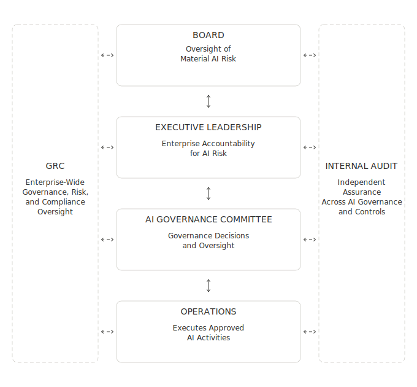

## **Purpose**

To show how AI governance authority, accountability, execution, oversight, and assurance are structured across Enterprise Company.

## **Scope**  
Applies to the enterprise governance structure for AI systems and tools developed, acquired, deployed, or used by Enterprise Company.

## **Architecture**

## **How It Works**

- Authority and decisions flow downward from the Board to Operations.

- Results and material issues flow upward for oversight and decision-making.

- GRC provides enterprise-wide governance, risk, and compliance oversight.

- Internal Audit provides independent assurance to the Board and communicates findings to Executive Leadership and responsible functions.

## **Boundary**

This architecture defines the governance structure and reporting relationships. It does not define detailed responsibilities, decision criteria, or lifecycle steps.

## **Related Artifacts**

- [AI Governance Policy](Policy.md)
- [AI Governance Operating Model](Operating-Model.md)
- [Governance Workflow](Workflow.md)

## **References**

See: [References](References.md)

---  

**Tom Kowalski**  
Senior GRC & Cybersecurity Advisor  
*AI Governance, Enterprise Risk, Information Security*

LinkedIn: <https://www.linkedin.com/in/kowalskitom1>

© 2026 Tom Kowalski. All rights reserved.

*Enterprise Company is a fictional organization created solely for portfolio demonstration purposes. This document contains original work and does not represent any client, employer, or commercial implementation.*
