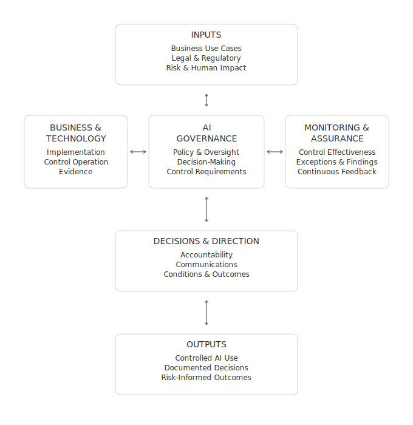

## **Purpose**

How Enterprise Company receives governance inputs, coordinates governance activities, makes decisions, directs implementation, evaluates performance and evidence, and produces controlled, risk-informed outcomes.
 
## **Scope** 
Applies to AI systems and tools proposed, approved, developed, acquired, deployed, or used across the enterprise. 

## **How the Operating Model Works** 

### **Inputs**  
Business information, applicable legal and regulatory requirements, risk, and human impact.  

### **AI Governance**  
The center of the model sets policy, provides oversight, makes informed decisions, gives direction, and establishes controls.

### **Business and Technology Functions**  
Implement decisions, operate controls and processes, and maintain evidence.

### **Monitoring and Assurance**  
Evaluate performance, risk, control effectiveness, incidents, exceptions, and findings to inform reassessment, escalation, and continual improvement. 

### **Decisions and Direction**  
Communicate outcomes, conditions, accountability, direction, and escalation.  

### **Outputs**  
Controlled AI use, accountability, implemented requirements, and risk-informed outcomes.

## **Operating Model Visual**

_The two-way arrows show ongoing exchange, reassessment, escalation, and continual improvement across the operating model._    

## **Related Artifacts**

- [AI Governance Policy](Policy.md)
- [Governance Architecture](Governance-Architecture.md)
- [Governance Workflow](Workflow.md)
- [AI Risk Assessment](Risk-Assessment.md)
  

## **References**

See: [References](References.md)

  
---  

**Tom Kowalski**  
Senior GRC & Cybersecurity Advisor  
*AI Governance, Enterprise Risk, Information Security*

LinkedIn: <https://www.linkedin.com/in/kowalskitom1>

© 2026 Tom Kowalski. All rights reserved.

Enterprise Company is a fictional organization created solely for portfolio demonstration purposes. This document contains original work and does not represent any client, employer, or commercial implementation.
