## **Purpose**  
Defines the end-to-end process for evaluating, approving, deploying, monitoring, modifying, suspending, and retiring AI use cases.

## **Scope**  
Applies to AI use cases proposed, developed, acquired, deployed, modified, or retired by Enterprise Company.

## **Workflow**

## **Boundary**

Incident response, legal review, disciplinary action, and exceptions and escalations follow separate processes.

## **Related Artifacts**

- [AI Governance Policy](Policy.md)
- [AI Governance Architecture](Governance-Architecture.md)
- [AI Governance Operating Model](Operating-Model.md)
- [AI Risk Assessment](Risk-Assessment.md)
- [Exceptions and Escalation Process](Exceptions-and-Escalation.md)

## **References**

See: [References](References.md)

--- 

**Tom Kowalski**  
Senior GRC & Cybersecurity Advisor  
*AI Governance, Enterprise Risk, Information Security*

LinkedIn: <https://www.linkedin.com/in/kowalskitom1>

© 2026 Tom Kowalski. All rights reserved.

*Enterprise Company is a fictional organization created solely for portfolio demonstration purposes. This document contains original work and does not represent any client, employer, or commercial implementation.*
